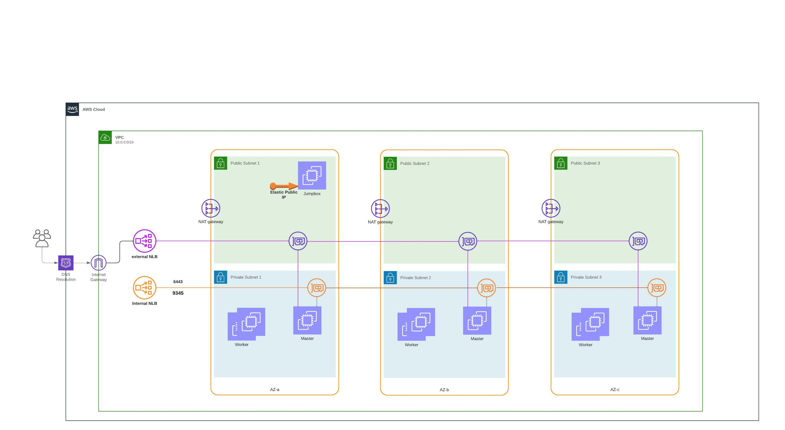

= Automated AWS provsioing for RKE2 deployment

This repo automates the deploying  AWS infrastructure including VMs, networking, load balancers, DNS configuration etc. needed for rke2

== Overview

This project uses mainly Terraform as infrastructure management and installation automation driver. All the user provisioned resource are created via the terraform scripts in this project.

== Infrastructure Architecture

The idea is to build a HA infrastructure with so we build multiple masters and agent nodes on multiple subnets and multiple az.

API server & register End point is exposed on two LB's public and private so the external CLI and external clients can talk on the public LB and the private LB is used to expose the API server & register End point for agent nodes.

it also take care of AWS cloud provider requirements https://rancher.com/docs/rke/latest/en/config-options/cloud-providers/aws/ from tagging and IAM PoV

