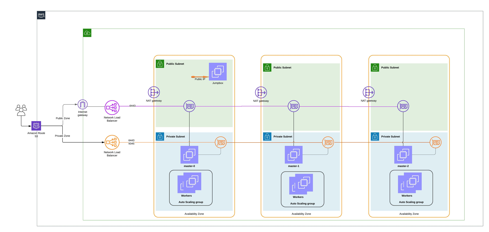

= Automated AWS provsioing for RKE2 deployment

This repo automates the deploying  AWS infrastructure including VMs, networking, load balancers, DNS configuration etc. needed for rke2

== Overview

This project uses mainly Terraform as infrastructure management and installation automation driver. All the user provisioned resource are created via the terraform scripts in this project.

== Infrastructure Architecture

The idea is to build a HA infrastructure that can be used later for RKE2 installation which also support the https://rancher.com/docs/rke/latest/en/config-options/cloud-providers/aws/[AWS cloud provider requirements].

SO how to achieve this HA ?
. We will build our VPC with multiple subnets (public & private) each on different AZ 
. API End Point, either API server or register End point is exposed on two LB's one is public and the other is private so that external CLI and external clients can talk on the public LB and the private LB is used to expose the API server & register End point for agent nodes. This will segregate the communication for both security and performance.
. Create https://docs.aws.amazon.com/autoscaling/ec2/userguide/AutoScalingGroup.html[ASG] for worker nodes, each on different private subnets each on different AZ, this ASG will allow the https://github.com/kubernetes/autoscaler/blob/master/cluster-autoscaler/cloudprovider/aws/README.md[Cluster autoscaler] later on to scale nodes automatically for us on different AZ.

it also take care of https://rancher.com/docs/rke/latest/en/config-options/cloud-providers/aws/[AWS cloud provider requirements] by tagging needed resources and creating the required IAM.

The following diagram shows In a high level the different components that will be created.

=== Terraform Modules

==== vpc
As expected this module Create the VPC, subnets (public & private), security groups and two load balancers - public for Control Plane (6443), private for Control Plane (6443 & 9345)

==== iam
define AWS authorities for the masters, workers, and also cluster auto scaler auto-discovery. Those roles and role policies are important so AWS cloud provider can have the needed privileges to work afterwards.

==== jumpbox
module to provision a jumpbox with public IP & SSH access so we can use it to manage the deployment in more controlled way (we will only enable ssh to this node).

==== nodes
create ec2 nodes and place them in the required subnet with the needed IAM instance profile role. This is the primary method for defining Master nodes (Master nodes will not be part of cluster auto-scaler discovery group) 

==== nodetemplate
create auto scale group (ASG) and launch template that will be used by cluster auto-scalers to resize worker (agent-nodes). This is the primary method for defining nodes in which cluster workloads will run.

==== route53
generate a public and/or private hosted zone using route 53

== Usage

=== Prerequisites 

git cli

https://www.atlassian.com/git/tutorials/install-git#linux

terraform 0.15 or later

aws privileges

=== Installation Procedure

git clone

Deploying the cluster
Initialize the Terraform:

terraform init
Run the terraform provisioning:

terraform plan
terraform apply